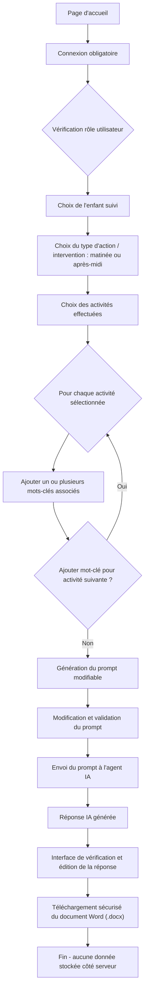

# Synapses EMS - Web App

### FLowChart

```mermaid
flowchart TD
    A["Page d'accueil"] --> B["Connexion obligatoire"]
    B --> C{"Vérification rôle utilisateur"}
    C --> D["Choix de l'enfant suivi"]
    D --> E["Choix du type d'action / intervention : matinée ou après-midi"]
    E --> F["Choix des activités effectuées"]
    
    F --> G{"Pour chaque activité sélectionnée"}
    G --> H["Ajouter un ou plusieurs mots-clés associés"]
    H --> I{"Ajouter mot-clé pour activité suivante ?"}
    I -->|Oui| G
    I -->|Non| J["Génération du prompt modifiable"]
    
    J --> K["Modification et validation du prompt"]
    K --> L["Envoi du prompt à l'agent IA"]
    L --> M["Réponse IA générée"]
    M --> N["Interface de vérification et édition de la réponse"]
    N --> O["Téléchargement sécurisé du document Word (.docx)"]
    O --> P["Fin - aucune donnée stockée côté serveur"]
```

### Authors
- [Cyprien Gehu](https://guthub.com/cyprien-GEHU)
- [Adrien Vieilledent](https://guthub.com/vlldnt)