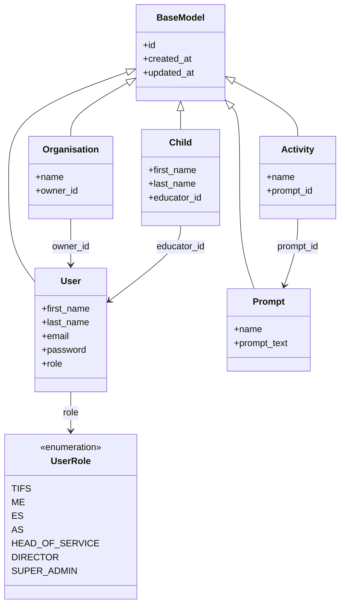

# Synapses EMS - Web App

### Flowchart

### Class Diagram

```mermaid
classDiagram

class BaseModel {
  +id
  +created_at
  +updated_at
}

class User {
  +first_name
  +last_name
  +email
  +password
  +role
}

class Child {
  +first_name
  +last_name
  +educator_id
}

class Prompt {
  +name
  +prompt_text
}

class Organisation {
  +name
  +owner_id
}

class Activity {
  +name
  +prompt_id
}

class UserRole {
  <<enumeration>>
  TIFS
  ME
  ES
  AS
  HEAD_OF_SERVICE
  DIRECTOR
  SUPER_ADMIN
}

BaseModel <|-- User
BaseModel <|-- Child
BaseModel <|-- Prompt
BaseModel <|-- Organisation
BaseModel <|-- Activity

User --> UserRole : role
Organisation --> User : owner_id
Child --> User : educator_id
Activity --> Prompt : prompt_id
```

### Authors
- [Cyprien Gehu](https://guthub.com/cyprien-GEHU)
- [Adrien Vieilledent](https://guthub.com/vlldnt)