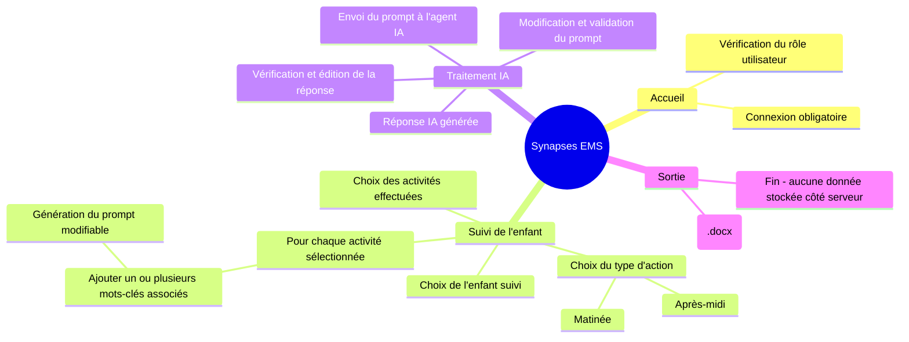

# Synapses EMS - Web App

### MindMap

```mermaid
mindmap
    root((Synapses EMS))
        Accueil
            Connexion obligatoire
            Vérification du rôle utilisateur
        Suivi de l'enfant
            Choix de l'enfant suivi
            Choix du type d'action
                Matinée
                Après-midi
            Choix des activités effectuées
            Pour chaque activité sélectionnée
                Ajouter un ou plusieurs mots-clés associés
                    Génération du prompt modifiable
        Traitement IA
            Modification et validation du prompt
            Envoi du prompt à l'agent IA
            Réponse IA générée
            Vérification et édition de la réponse
        Sortie
            Téléchargement sécurisé du document Word (.docx)
            Fin - aucune donnée stockée côté serveur
```

### Authors
- [Cyprien Gehu](https://guthub.com/cyprien-GEHU)
- [Adrien Vieilledent](https://guthub.com/vlldnt)