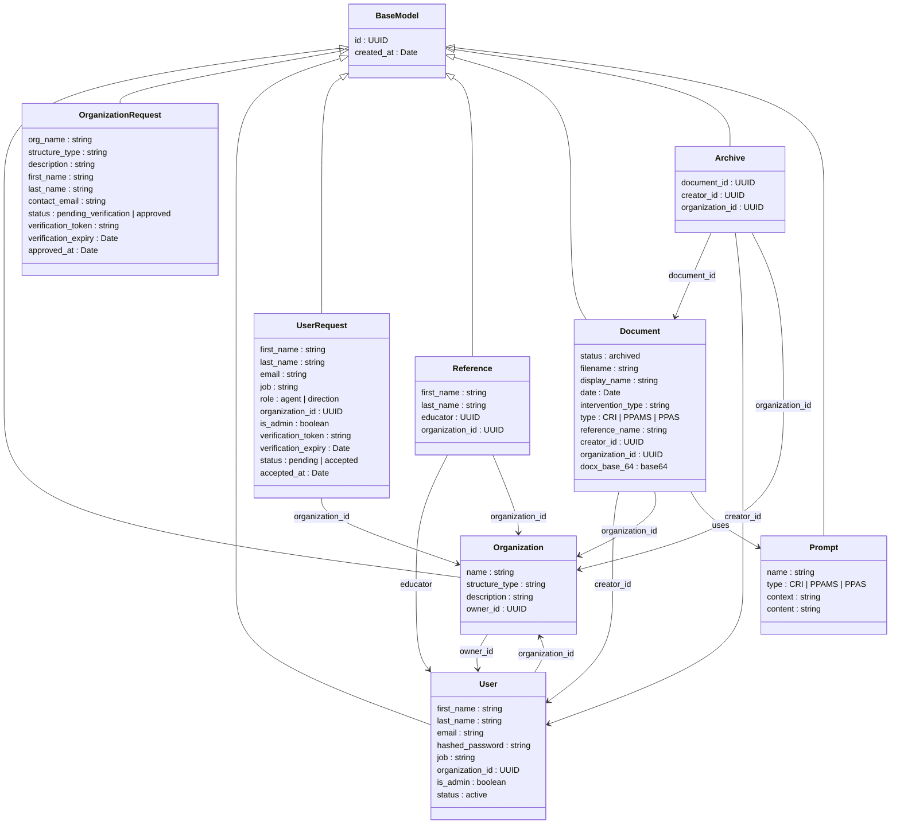
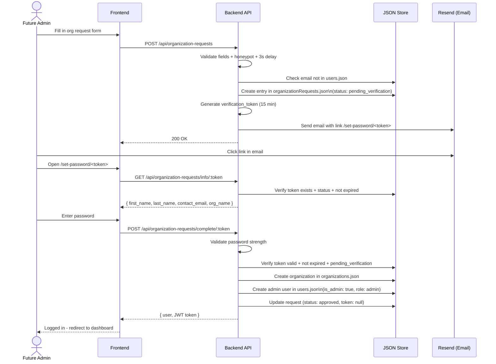
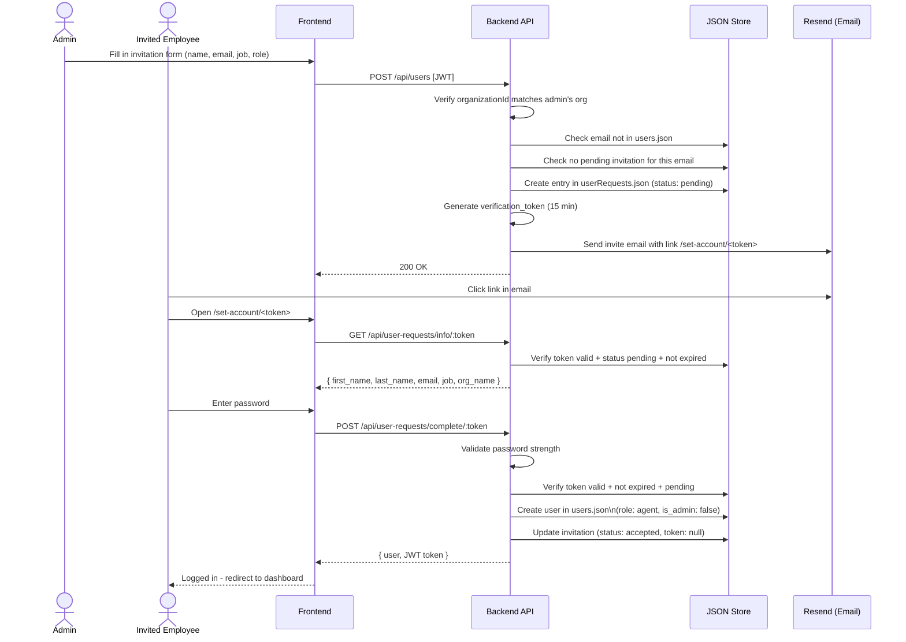
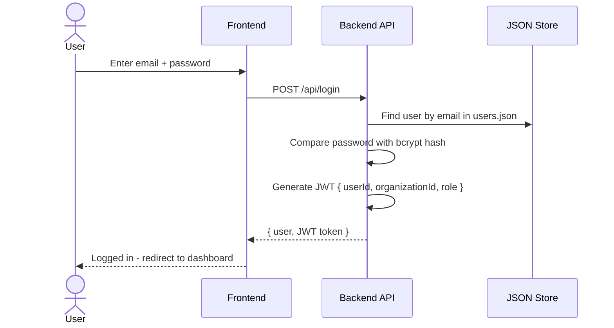
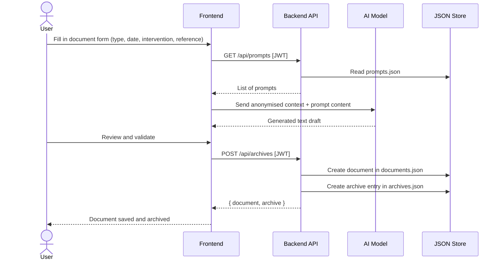

# Synapses ESMS - Web App

### Overview

**SYNAPSES ESMS** is a social-impact project aiming to develop an **AI-assisted web application** for professionals working in the **social and medico-social sector (ESMS)**.

Professionals in this sector spend a significant amount of time producing administrative and professional documents such as intervention reports, educational assessments, personalized support plans, meeting summaries, and activity reports.  
The goal of SYNAPSES ESMS is to **reduce this administrative burden** by providing an **AI-assisted writing tool** that helps structure and generate professional documents.

The tool is designed to **support professionals rather than replace them**, allowing users to input key information about a situation and receive a structured draft that can then be reviewed and edited.

A major requirement is to ensure **data privacy and confidentiality**, particularly by guaranteeing that **no personal or identifiable data is transmitted to the AI system**.

---

### Flowchart

---

### Class Diagram

---

### Sequence Diagrams

#### 1. Organisation creation (from landing page)

#### 2. User invitation (from admin dashboard)

#### 3. Login

#### 4. Document creation & archive

---

### Authors

- [Cyprien Gehu](https://github.com/cyprien-GEHU)
- [Adrien Vieilledent](https://github.com/vlldnt)
