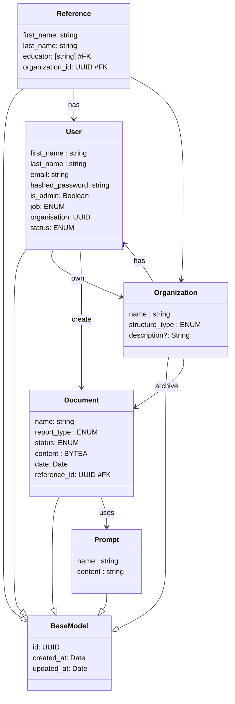

```mermaid
classDiagram

%% =====================
%% BASE MODEL
%% =====================
class BaseModel {
    id: UUID
    created_at: Date
    updated_at: Date
}

class User {
    first_name : string
    last_name : string
    email: string
    hashed_password: string
    is_admin: Boolean
    job: ENUM
    organisation: UUID 
    status: ENUM
}

class Organization {
    name : string
    structure_type : ENUM
    description?: String
}

class Reference {
    first_name: string
    last_name: string
    educator: [string] #FK
    organization_id: UUID #FK
}

class Document {
    name: string
    report_type : ENUM
    status: ENUM 
    content : BYTEA
    date: Date
    reference_id: UUID #FK
}

class Prompt {
    name : string
    content : string
}

%% =====================
%% INHERITANCE (CORRECT)
%% =====================
User --|> BaseModel
Organization --|> BaseModel
Reference --|> BaseModel
Document --|> BaseModel
Prompt --|> BaseModel


Organization --> User: has

Document --> Prompt: uses

Reference --> User: has 
Reference --> Organization
User --> Organization: own

Organization --> Document: archive
User --> Document: create
```