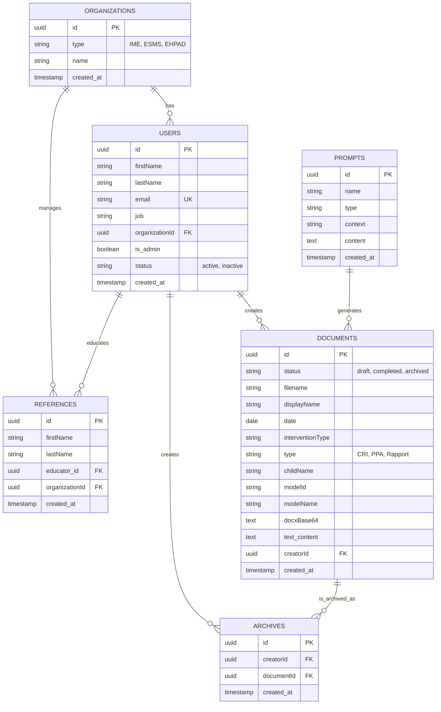
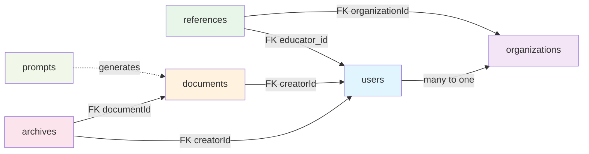

# 🗄️ Synapses ESMS - Database Schema

Base de données PostgreSQL pour la gestion de documents et d'accompagnement en ESMS.

---

## 📊 Entity Relationship Diagram



---

## 📋 Tables Détaillées

### 1. **ORGANIZATIONS**
Organisations (IME, ESMS, EHPAD)

| Colonne | Type | Notes |
|---------|------|-------|
| `id` | UUID | PK |
| `type` | VARCHAR | IME, ESMS, EHPAD |
| `name` | VARCHAR | Nom de l'organisation |
| `created_at` | TIMESTAMP | |

---

### 2. **USERS**
Utilisateurs et professionnels

| Colonne | Type | Notes |
|---------|------|-------|
| `id` | UUID | PK |
| `firstName` | VARCHAR | |
| `lastName` | VARCHAR | |
| `email` | VARCHAR | UNIQUE |
| `job` | VARCHAR | Éducateur spécialisé, Admin... |
| `organizationId` | UUID | FK → organizations |
| `is_admin` | BOOLEAN | |
| `status` | VARCHAR | active, inactive |
| `created_at` | TIMESTAMP | |

---

### 3. **REFERENCES**
Usagers accompagnés

| Colonne | Type | Notes |
|---------|------|-------|
| `id` | UUID | PK |
| `firstName` | VARCHAR | |
| `lastName` | VARCHAR | |
| `educator_id` | UUID | FK → users |
| `organizationId` | UUID | FK → organizations |
| `created_at` | TIMESTAMP | |

---

### 4. **DOCUMENTS**
Documents générés (CRI, PPA, Rapports...)

| Colonne | Type | Notes |
|---------|------|-------|
| `id` | UUID | PK |
| `status` | VARCHAR | draft, completed, archived |
| `filename` | VARCHAR | Nom du fichier |
| `displayName` | VARCHAR | Nom d'affichage |
| `date` | DATE | Date de l'intervention |
| `interventionType` | VARCHAR | Entretien individuel, Visite domicile... |
| `type` | VARCHAR | CRI, PPA, Rapport |
| `childName` | VARCHAR | Nom de l'usager (peut être anonyme) |
| `modelId` | VARCHAR | Modèle d'IA utilisé (Mistral, OpenAI...) |
| `modelName` | VARCHAR | Nom du modèle |
| `docxBase64` | TEXT | Fichier DOCX encodé en base64 |
| `text` | TEXT | Contenu texte |
| `creatorId` | UUID | FK → users |
| `created_at` | TIMESTAMP | |

---

### 5. **ARCHIVES**
Historique d'archivage

| Colonne | Type | Notes |
|---------|------|-------|
| `id` | UUID | PK |
| `creatorId` | UUID | FK → users (qui a archivé) |
| `documentId` | UUID | FK → documents |
| `created_at` | TIMESTAMP | |

---

### 6. **PROMPTS**
Modèles d'IA et templates

| Colonne | Type | Notes |
|---------|------|-------|
| `id` | UUID | PK |
| `name` | VARCHAR | cr_intervention, ppa_medico_social... |
| `type` | VARCHAR | CRI, PPA, Rapport |
| `context` | VARCHAR | Description du prompt |
| `content` | TEXT | Contenu complet du prompt |
| `created_at` | TIMESTAMP | |

---

### 7. **MENUS**
Configuration de la navigation

| Colonne | Type | Notes |
|---------|------|-------|
| `id` | UUID | PK |
| `label` | VARCHAR | Texte affiché |
| `route` | VARCHAR | Chemin de navigation |
| `icon` | VARCHAR | Nom de l'icône |
| `section` | VARCHAR | Groupement du menu |
| `roleAccess` | JSONB | Array: agent, direction, admin |

---

### 8. **DASHBOARD_CARDS**
Cartes du tableau de bord

| Colonne | Type | Notes |
|---------|------|-------|
| `id` | UUID | PK |
| `title` | VARCHAR | Titre de la carte |
| `description` | TEXT | Description |
| `ctaText` | VARCHAR | Texte du bouton |
| `route` | VARCHAR | Route de navigation |
| `color` | VARCHAR | Variable CSS |
| `disabled` | BOOLEAN | Si la carte est désactivée |

---

### 9. **STRUCTURE_TYPES**
Typage des structures d'accueil

| Colonne | Type | Notes |
|---------|------|-------|
| `id` | UUID | PK |
| `categories` | JSONB | Categories (Protection enfance, Handicap...) |
| `options` | JSONB | Array des options disponibles |

---

## 🔗 Relations



---

## 🚀 Migration PostgreSQL

### Phase 1 : Tables de base

```sql
-- Organizations
CREATE TABLE organizations (
    id UUID PRIMARY KEY DEFAULT gen_random_uuid(),
    type VARCHAR(50) NOT NULL,
    name VARCHAR(255) NOT NULL,
    created_at TIMESTAMP DEFAULT CURRENT_TIMESTAMP
);

-- Users
CREATE TABLE users (
    id UUID PRIMARY KEY DEFAULT gen_random_uuid(),
    firstName VARCHAR(100) NOT NULL,
    lastName VARCHAR(100) NOT NULL,
    email VARCHAR(255) UNIQUE NOT NULL,
    job VARCHAR(100),
    organizationId UUID NOT NULL REFERENCES organizations(id),
    is_admin BOOLEAN DEFAULT FALSE,
    status VARCHAR(50) DEFAULT 'active',
    created_at TIMESTAMP DEFAULT CURRENT_TIMESTAMP
);

-- References
CREATE TABLE references (
    id UUID PRIMARY KEY DEFAULT gen_random_uuid(),
    firstName VARCHAR(100) NOT NULL,
    lastName VARCHAR(100) NOT NULL,
    educator_id UUID NOT NULL REFERENCES users(id),
    organizationId UUID NOT NULL REFERENCES organizations(id),
    created_at TIMESTAMP DEFAULT CURRENT_TIMESTAMP
);
```

### Phase 2 : Documents et archives

```sql
-- Documents
CREATE TABLE documents (
    id UUID PRIMARY KEY DEFAULT gen_random_uuid(),
    status VARCHAR(50) DEFAULT 'draft',
    filename VARCHAR(255),
    displayName VARCHAR(255),
    date DATE,
    interventionType VARCHAR(100),
    type VARCHAR(50),
    childName VARCHAR(255),
    modelId VARCHAR(100),
    modelName VARCHAR(100),
    docxBase64 TEXT,
    text TEXT,
    creatorId UUID NOT NULL REFERENCES users(id),
    created_at TIMESTAMP DEFAULT CURRENT_TIMESTAMP
);

-- Archives
CREATE TABLE archives (
    id UUID PRIMARY KEY DEFAULT gen_random_uuid(),
    creatorId UUID NOT NULL REFERENCES users(id),
    documentId UUID NOT NULL REFERENCES documents(id),
    created_at TIMESTAMP DEFAULT CURRENT_TIMESTAMP
);
```

### Phase 3 : Configuration

```sql
-- Prompts
CREATE TABLE prompts (
    id UUID PRIMARY KEY DEFAULT gen_random_uuid(),
    name VARCHAR(100) NOT NULL,
    type VARCHAR(50),
    context VARCHAR(255),
    content TEXT NOT NULL,
    created_at TIMESTAMP DEFAULT CURRENT_TIMESTAMP
);

-- Menus
CREATE TABLE menus (
    id UUID PRIMARY KEY DEFAULT gen_random_uuid(),
    label VARCHAR(100),
    route VARCHAR(255),
    icon VARCHAR(100),
    section VARCHAR(100),
    roleAccess JSONB
);

-- Dashboard Cards
CREATE TABLE dashboard_cards (
    id UUID PRIMARY KEY DEFAULT gen_random_uuid(),
    title VARCHAR(255),
    description TEXT,
    ctaText VARCHAR(100),
    route VARCHAR(255),
    color VARCHAR(100),
    disabled BOOLEAN DEFAULT FALSE
);

-- Structure Types
CREATE TABLE structure_types (
    id UUID PRIMARY KEY DEFAULT gen_random_uuid(),
    categories JSONB,
    options JSONB
);
```

### Phase 4 : Index et contraintes

```sql
-- Index de performance
CREATE INDEX idx_users_org_id ON users(organizationId);
CREATE INDEX idx_documents_creator_id ON documents(creatorId);
CREATE INDEX idx_documents_status ON documents(status);
CREATE INDEX idx_documents_created_at ON documents(created_at);
CREATE INDEX idx_references_educator_id ON references(educator_id);
CREATE INDEX idx_archives_document_id ON archives(documentId);
CREATE INDEX idx_archives_creator_id ON archives(creatorId);

-- Contraintes
ALTER TABLE documents
    ADD CONSTRAINT chk_document_status 
    CHECK (status IN ('draft', 'completed', 'archived'));

ALTER TABLE users
    ADD CONSTRAINT chk_user_status 
    CHECK (status IN ('active', 'inactive'));
```

---

## 🔐 Recommandations de sécurité

### Données sensibles à chiffrer
- `email` (utilisateurs)
- `firstName`, `lastName` (usagers)
- `docxBase64` (documents)

### Audit et traçabilité
Ajouter colonnes supplémentaires :
```sql
ALTER TABLE users ADD COLUMN updated_at TIMESTAMP;
ALTER TABLE users ADD COLUMN updated_by VARCHAR(50);
ALTER TABLE documents ADD COLUMN updated_at TIMESTAMP;
ALTER TABLE documents ADD COLUMN updated_by VARCHAR(50);
```

### Soft delete (suppression logique)
```sql
ALTER TABLE documents ADD COLUMN deleted_at TIMESTAMP DEFAULT NULL;
ALTER TABLE users ADD COLUMN deleted_at TIMESTAMP DEFAULT NULL;
```

---

## 📈 Optimisations futures

| Aspect | Recommandation |
|--------|-----------------|
| **Performance** | Partitionner `documents` par année (created_at) |
| **Stockage** | Externaliser `docxBase64` vers object storage (S3, MinIO) |
| **Scalabilité** | Ajouter table `document_versions` pour l'historique |
| **Recherche** | Index full-text sur `documents.text` pour recherche rapide |
| **Analytics** | Créer tables dénormalisées pour dashboards |

---

## 📝 Statut de migration

- ✅ Fichiers JSON existants
- ⏳ PostgreSQL schema défini
- ⏳ Migration des données
- ⏳ Tests de performance
- ⏳ Déploiement en production

---

**Dernière mise à jour** : 2026-04-22
